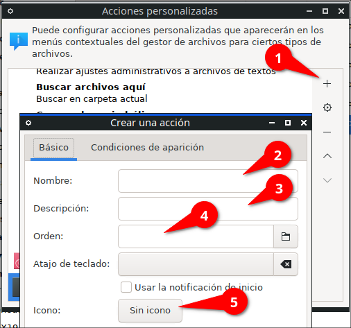
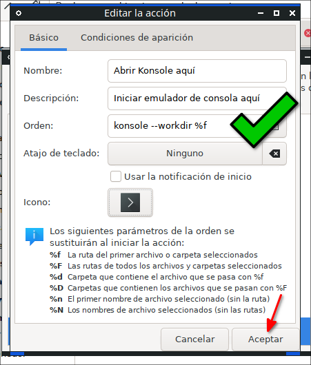
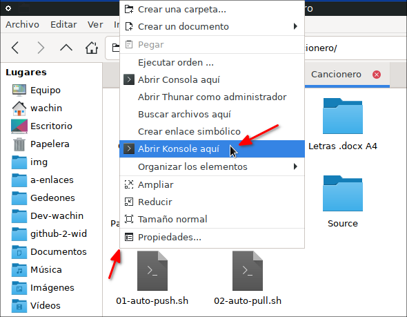
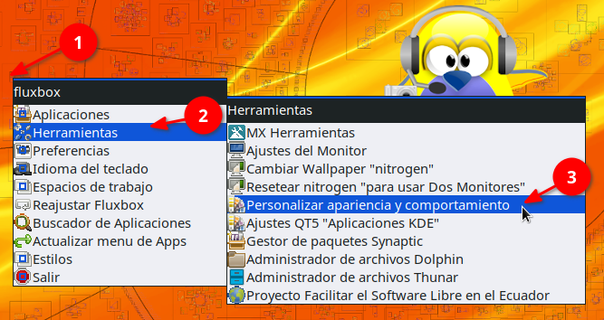
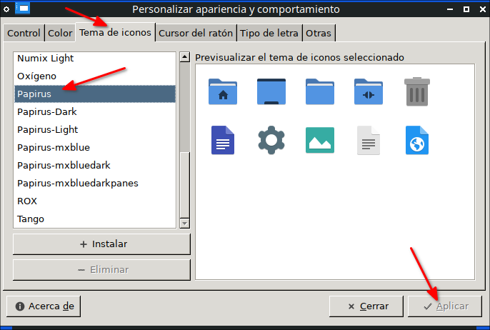
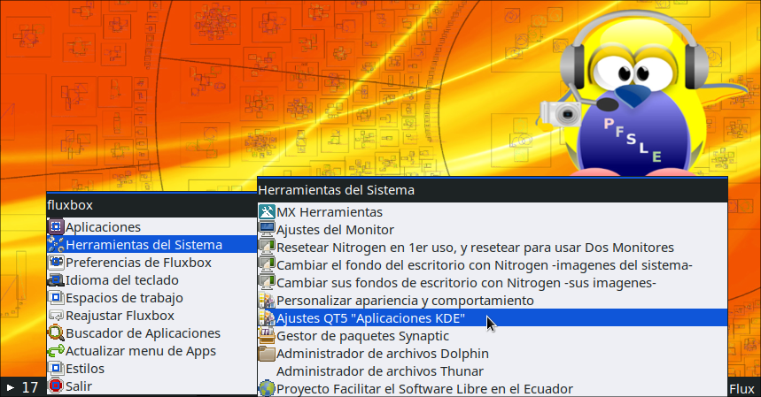

# RisenPC-Fluxbox-ES
Fluxbox personalizado en español para Ordenadores con pocos recursos

Si bien es cierto MX Linux 21 tiene una versión con Fluxbox no me gusta cómo la han hecho, ejemplo ellos han reemplazado la barra de tareas que si tiene Fluxbox por la de un programa, yo prefiero usar la que tiene Fluxbox

# Requerimientos
Se requiere lo sigiente:

MX Linux 21 versión XFCE de 32 o 64 bits

**Descargar desde:**

https://sourceforge.net/projects/mx-linux/files/Final/Xfce/  

redirigido desde:

https://mxlinux.org/download-links/  

**Explicación.-** Esta versión de MX Linux XFCE no trae instalado la versión de Fluxbox MX Linux por lo cual allí podremos usar estas configuraciones

# Instalación de Fluxbox y dependencias
Este tutorial ha sido hecho en MX Linux 21 la versión XFCE. Con lo siguiente nos aseguraremos de habilitar lo más basico además de dejar configuradas las aplicaciones KDE 

**Dependencias**

    sudo apt-get install fluxbox lxappearance lxrandr pnmixer numlockx \
    xfce4-appfinder xfce4-notes gnome-terminal qt5ct nitrogen \
    gammy breeze gnome-icon-theme gxkb thunar
    
# Borre los estilos del paquete de Fluxbox  

Esto es porque los que vienen allí son para mi de mala calidad:

`sudo rm -fr /usr/share/fluxbox/styles/`

No se preocupe aquí usaremos los de MX Fluxbox

# Borrar los archivos originales de Fluxbox si Ud los usaba
(Si no es este su caso omita este paso) Si usted estaba usando Fluxbox debe haber una carpeta escondida, veala con Ctrl + H

.fluxbox

esa carpeta hay que borrarla si es que la tenía, así:

`sudo rm -fr ~/.fluxbox`

# Instalar RisenPC Fluxbox Español
A continuación les dejaré dos maneras de instalar RisenPC Fluxbox ES, la primera es para un usuario normal

Ponga en una terminal:

    git clone https://github.com/wachin/RisenPC-Fluxbox-ES
    cd RisenPC-Fluxbox-ES
    cp .fluxbox ~/.fluxbox

# Instalar RisenPC Fluxbox Español para Desarrolladores
Si usted es un desarrollador y le gusta esta manera de personalización de Fluxbox y lo quisiera cambiar a su gusto, primero:

- Haga un fork de mi repositorio:

[https://github.com/wachin/RisenPC-Fluxbox-ES](https://github.com/wachin/RisenPC-Fluxbox-ES)

- Luego instalelo así:

```
git clone https://github.com/wachin/RisenPC-Fluxbox-ES
ln -s RisenPC-Fluxbox-ES .fluxbox
```

esto pondrá en su HOME la carpeta:

RisenPC-Fluxbox-ES

y creará un enlace a:

.fluxbox

entonces usted podrá hacer cambios en el repositorio y automáticamente se verán reflejados en .fluxbox que es la carpeta de configuraciones de Fluxbox y serán aplicados los cambios en el menú u otras configuraciones que haga.

# qt5ct utilidad de configuración de Qt5
Ponga en una terminal:

    echo "export QT_QPA_PLATFORMTHEME="qt5ct"" >> ~/.profile

Con esto hemos añadido esa última línea al archivo, esto es necesario para las aplicaciones que han sido escritas en Qt (KDE) como por ejemplo Dolphin, Kate, etc para poder elegir los iconos y temas de ellas

Ahora cierre sesión y entre en la sesión de Fluxbox 


# Atajos de teclado
Las siguientes configuraciones pertenecen al archivo .fluxbox/keys

## AppFinder
Para abrir el buscador de aplicaciones AppFinder (xfce4-appfinder)

Tecla Windows + A

**Nota:** La Tecla de Windows también es conocida como Super, o Mod4 en las configuraciones de los atajos de teclado de Fluxbox


## Abrir menu de aplicaciones
EL siguiente atajo de teclado es para abrir el menu de aplicaciones en cualquier lugar donde esté el cursor, aplaste:

Tecla Windows + M

Si no elige ninguna aplaste ESC para escapar

## Poner una ventana siempre encima
Si usted por ejemplo tiene abierta la terminal y quisiera que ella esté siempre enfrente de las demás ventanas aplaste:

Alt + V

para devolver esa ventana a su estado normal, estando enfrente de la ventana de esa aplicación otra vez dar:

Alt + V

**Nota:** La Tecla Alt se llama Mod1 en las configuraciones de los atajos de teclado de Fluxbox


## Minimizar ventanas
En con las teclas:

Alt + Z

le puse este atajo de teclado porque para mi es más fácil de usar, pero si ustedes quisieran le pueden poner otro

**Nota**: Esto lo modifiqué del archivo "key" en # current window commands donde originalmente tenía:  Mod1 + F9


 ## Minimizar todas las ventanas (no se puede)
 Pngo este título pues yo habría querido que hubiera una manerea de poder minimizar todas las ventanas de programas abiertas como en Windows (Super + D) pero no se puede, aunque se puede minimizando una por una


# Control de brillo para evitar cansancio ocular

Gammy está incluido en el archivo .fluxbox/startup al autoinicio, por lo que cuando usted entre en la sesión, Gammy se abrirá a la derecha abajo entre los iconos, allí usted la puede configurar a su gusto, también puede ver la entrada:

**Instalando Gammy 0.9.64 en MX Linux 21 desde los repositorios (Herramienta para ajustar el brillo / temperatura del monitor)**  
https://facilitarelsoftwarelibre.blogspot.com/2022/01/control-de-brillo-de-pantalla-con-gammy-en-linux.html


# Menu de aplicaciones con iconos con xdgmenumaker
Ponga una por una estas siete lineas de comandos en una terminal y ejecútelas:

```
sudo apt-get install txt2tags python3-xdg gobject-introspection
git clone https://github.com/gapan/xdgmenumaker
cd xdgmenumaker
make
sudo su
make install
exit
```

Con esto tendrá iconos de la mayoría de las aplicaciones en el menú de fluxbox


## Creando el Menu de fluxbox, con xdgmenumaker

La primera vez que ha hecho esta instalación debe crear el menu, ponga en una terminal:

    xdgmenumaker -i -s16 -f fluxbox > ~/.fluxbox/xdg_menu

esto es necesario hacerlo sólo una vez

En ese archivo xdg_menu se escribirán todas las aplicaciones que están instaladas en su sistema para que estén disponibles para el menú de Fluxbox 

ahora si puede reiniciar MX Linux 21 y entre en la sesión de Fluxbox y cuando de clic derecho en el escritorio o clic derecho en una de las dos esquinas o Super + M quedará así:


## Actualizar el menú de Fluxbox cada vez que instale alguna aplicación
Esto debe saberlo pues en esta instalación se utiliza a xdgmenumaker pero hay que actualizar el menu después que uno instala alguna aplicación, para hacerlo clic en:

**Actualizar menu de Apps**  


# Cómo cambiar de Estilo de Fluxbox
Cuando usted cambie de estilo:

En es escritorio clic derecho en el menú, o en las esquinas o Super + M y clic en **Estilos**


en esta imagen ustedes ven que se ven bien los nombres de los estilos disponibles, sin embargo cuando elijan otro estilo muy posiblemente no se verán bien, para que se vean bien si lo desean pueden cerrar sesión y cuando entren otra vez ya se verán bien las letras, pero esto de cerrar sesión no es necesario de hacerlo del todo, pueden seguir usando Fluxbox y ya en el siguiente ingreso se verá bien.

Por cierto hay algunos de estos temas en lo que al cambiar de tema no se ven todos los estilos disponibles, para arreglar eso de clic:

En es escritorio clic derecho en el menú, o en las esquinas o Super + M y clic en **Reajustar Fluxbox**


al hacer eso ya se verán bien todos los estilos disponibles


# Cambiar el idioma del teclado
Les he dejado un menú para cambiar rápido el teclado

En es escritorio clic derecho en el menú, o en las esquinas o Super + M y clic en **Idioma del teclado**


No hay muchos idiomas, pero si ustedes necesiten algún otro me avisan


# Editar las opciones de Fluxbox
Para facil acceso les he dejado 

En es escritorio clic derecho en el menú, o en las esquinas o Super + M y clic en **Preferencias**


se abrirá el editor de texto que ustedes usen

# Problemas con abrir terminal en Thunar, cambiar por otra terminal
Si usted usa la opción de abrir la terminal aquí de Thunar pues no lo haga pues la terminal de XFCE (xfce4-terminal) no funciona bien en Fluxbox no se porqué, mejor use Konsole, o gnome-terminal u otra

para hacerlo en el siguiente ejemplo con Konsole (debe ternerla instalada) añada otra terminal así, clic en:

**Editar --> Configurar Acciones personalizadas**


allí clic en el + y llene las siguientes acciones:



con los siguientes datos:

Nombre: Abrir Konsole aquí  
Descripción: Iniciar emulador de consola aquí  
Orden: konsole --workdir %f  
  
En icono pongale un icono de terminal, de clic en el botón

Icono:

luego clic en y ponga:

Seleccionar icono de: Todos los iconos
Buscar un icono: utilities-terminal

y aceptar


debe de quedarle así:



cuando quiera abrir terminal aquí le aparecerá disponible Konsole



Si quiera abrir terminal aquí con gnome terminal ponga así (cambia un poco la orden):

Nombre: Abrir Gnome Terminal aquí  
Descripción: Iniciar emulador de consola aquí  
Orden: gnome-terminal %f  
  
y en icono lo mismo de arriba

# Temas de iconos recomendados para usar Thunar 
Por defecto será usado el tema de iconos de Gnome que instalamos arriba y se verá el icono en la barra de herramientas, pero si usted desea usar otro como lo es Breeze, ya no se verá el icono de Thunar en la barra de herramientas

Si usted quiere usar otro tema de iconos uno de los que recomiendo es:

Papirus

para usarlo 

**Menú --> Herramientas --> Personalizar apariencia y comportamiento**

**Nota:** El menú principal de Fluxbox se lo puede abrir desde escritorio con clic derecho, o en las esquinas abajo izquierda o derecha abajo, o con el atajo de teclado Super + M



allí en la pestaña:

Tema de iconos



También pueden usar las variantes:

Papirus-Dark  
Papirus-Light  
  
además el tema:

Numix también debería de funcionar bien. Pueden probar otros si desean

este tema de iconos es además compatible con las aplicaciones KDE si lo usaran también al ponerlo en "Qt5Ct"


# Temas de iconos para aplicaciones KDE (Qt)
Para estas aplicaciones se recomienda usar

Breeze  
Papuris  
Oxygen  
  
se configura en:

**Menú --> Herramientas --> Ajustes Qt "Aplicaciones KDE"**  

**Nota:** El menú principal de Fluxbox se lo puede abrir desde escritorio con clic derecho, o en las esquinas abajo izquierda o derecha abajo, o con el atajo de teclado Super + M



y allí en la pestaña:

Tema de iconos


este tema además es compatible con 

Dolphin  

como se explica con más detalle en:  

**Cambiar colores en carpetas de Dolphin (Administrador de archivos) en MX Linux 21, antiX 21 basados en Debian 11 Bullseye, y Ubuntu 22.04 y otros con "Dolphin Folder Color"**  
[https://facilitarelsoftwarelibre.blogspot.com/2022/05/cambiar-colores-en-carpetas-de-dolphin-con-dolphin-folder-color-en-debian-11-ubuntu-22.04.html](https://facilitarelsoftwarelibre.blogspot.com/2022/05/cambiar-colores-en-carpetas-de-dolphin-con-dolphin-folder-color-en-debian-11-ubuntu-22.04.html)  


Dios les bendiga  


# CONSULTAS: 

Editing_the_init_file  
http://fluxbox-wiki.org/category/howtos/en/Editing_the_init_file.html  

How to place the toolbar to the top in fluxbox? - Unix & Linux Stack Exchange   
https://unix.stackexchange.com/questions/146277/how-to-place-the-toolbar-to-the-top-in-fluxbox  

Fluxbox Documentation  
http://fluxbox.sourceforge.net/docbook/en/html/  

DSL Tips and Tricks :: Changing Fluxbox time display to 24 hour format  
http://www.damnsmalllinux.org/f/topic-3-26-12332-0.html  

IceWM install and setup guide  
http://forums.fedoraforum.org/showthread.php?t=282433  

xdgmenumaker  
https://github.com/gapan/xdgmenumaker  

Nitrogen - ArchWiki  
https://wiki.archlinux.org/title/nitrogen  

Xubuntu Thunar "Open Terminal Here" opens konsole in homefolder  
https://askubuntu.com/questions/891680/xubuntu-thunar-open-terminal-here-opens-konsole-in-homefolder  
https://askubuntu.com/a/892502  
